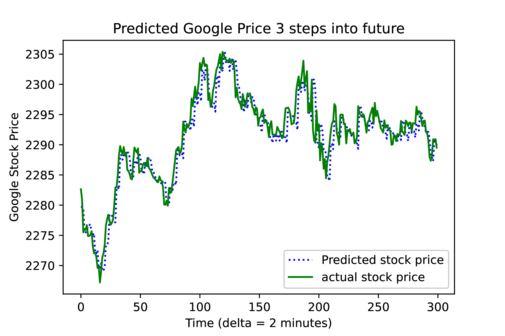

# PSIMS - Predicting Stocks by Inferencing Market Sentiment

The goal of this project is to setup stock market prediction model by leveraging sentiment analysis of Twitter data. The following sections will enable users of this code base to set up their own copy of this system and test it.



## Environment 

Please be sure to have the following libraries installed:
- transformers >= 4.6.0
- tensorflow >= 2.4.1
- nltk >= 3.2.4
- numpy >= 1.19.5
- pandas >= 1.0.5
- keras >= 2.4.3
- scikit-learn >= 0.24.1

Run `pip install -r requirements.txt` to install the needed packages (ideally in a virtual environment)

## Twitter Developer API setup

In order to be able to access the sentiment analysis portion of this project, please ensure that you have a Twitter Developer account. The instructions for setting up one can be found at the following [link](https://developer.twitter.com/en/apply-for-access).

Once you have access to the Twitter Developer account, go to the [Developer Portal](https://developer.twitter.com/en/portal/dashboard). Use the links on the left hand side to set up an App. After you've named your app, you will be provided with an Access Token, Access Key and a Bearer Token. Please save these for future use. Also be sure to replace the placeholder value for 'BEARER_TOKEN' variable in extract_sentiment.py with the bearer token from you application. This will allow you to make calls to the Twitter API to get tweets and process sentiment. 

## Getting Started

If you'd like to replicate this project please follow these steps: 

1. Run the cells in the Sentiment_Analysis_Model_Training.ipynb notebook. It is suggested that this be run in Cloud Computing environment such as GCP using GPUs to have a faster training time. Feel free to tweak the parameters to see if the sentiment analysis model improves. 
2. Save the final model from Sentiment_Analysis_Model_Training.ipynb. 
3. Replace 'model_pth' in extract_sentiment.py with your trained model path. 
4. Run the prediction notebook to get the prediction of the stock ticker of interest as stated in the next section. 

### Getting stock predictions
Running `prediction.ipynb` will use sentiment model from tweets to make predictions about the stock market.
In doing so it will train a new LSTM prediction model. 

Running `standalone_prediction.ipynb` will use 10 selected stocks which, as of May 14th 2021, had a consistently 
good or bad month to train on. Their sentiment describes if the stock had a good month or bad month.
In doing so it will train a new LSTM prediction model. 

## References

Johan Bollen and Huina Mao. 2011. Twitter mood as astock market predictor.IEEE Annals of the Historyof Computing, 44(10):91–94

```
@article{bollen2011twitter,
  title={Twitter mood predicts the stock market},
  author={Bollen, Johan and Mao, Huina and Zeng, Xiaojun},
  journal={Journal of computational science},
  volume={2},
  number={1},
  pages={1--8},
  year={2011},
  publisher={Elsevier}
}
```

Gao, Zhengjie, et al. "Target-dependent sentiment classification with BERT." IEEE Access 7 (2019): 154290-154299.

```
@article{gao2019target,
  title={Target-dependent sentiment classification with BERT},
  author={Gao, Zhengjie and Feng, Ao and Song, Xinyu and Wu, Xi},
  journal={IEEE Access},
  volume={7},
  pages={154290--154299},
  year={2019},
  publisher={IEEE}
}
```

[Twitter Training Dataset](https://www.kaggle.com/kazanova/sentiment140)
[Twitter Developer API](https://developer.twitter.com/en)

Parts of this code have been adopted from the following links: 
- [Twitter Sentiment Analysis with Naive Bayes](https://www.kaggle.com/lykin22/twitter-sentiment-analysis-with-naive-bayes-85-acc)
- [Sentiment Analysis with BERT](https://towardsdatascience.com/sentiment-analysis-in-10-minutes-with-bert-and-hugging-face-294e8a04b671)
- [Sample Twitter Python API setup code](https://github.com/twitterdev/Twitter-API-v2-sample-code/blob/master/Recent-Search/recent_search.py)
